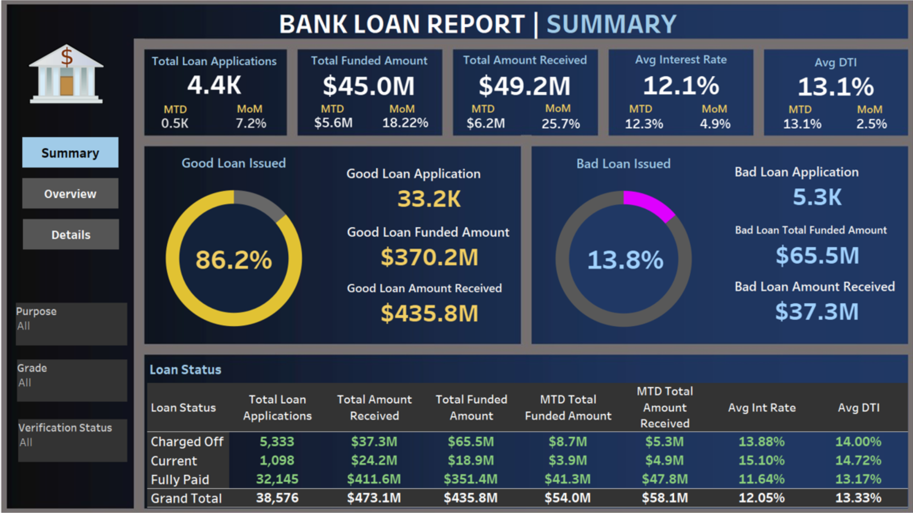
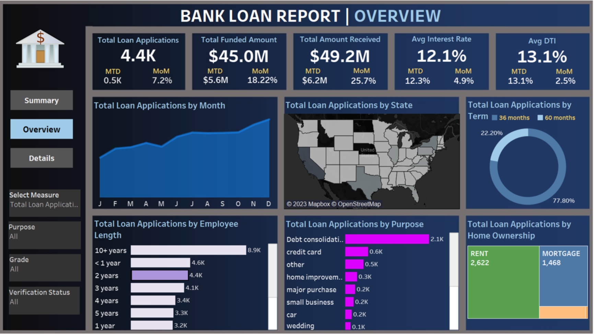
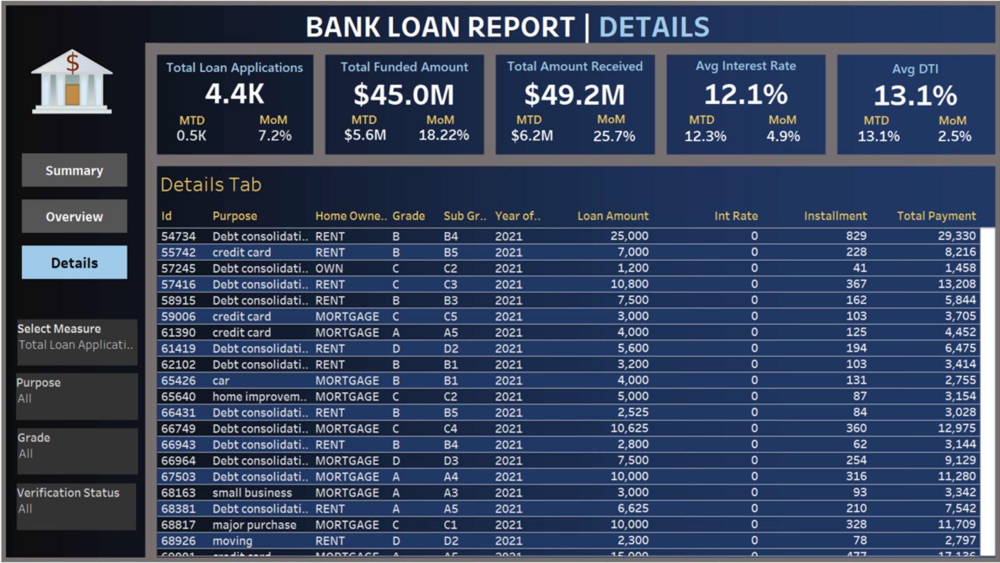

# Bank Loan Analysis

- Images created by Tableau, although they are static here, for full functionalities of responsive dashboards, please open bank_analysis.twbx in Tableau
- SQL Query used in this analysis: QUERY DOCUMENT.docx, bank_loan_sql.sql
- Data Set: financial_loan.csv

## 1. Introduction 
Bank loans are a crucial financial tool that enables individuals and businesses to achieve their goals and manage financial needs. However, it's essential for borrowers to understand the terms, costs, and responsibilities associated with loans to make informed financial decisions.
### Reasons for Analysing Bank Loan Data:
- Risk Assessment: One of the primary purposes of analysing loan data is to assess the risk associated with lending to a particular individual or business. Banks use data to evaluate the creditworthiness of borrowers, predict default probabilities, and determine interest rates and lending terms.
- Decision-making: Loan data analysis supports the decision-making process when evaluating loan applications. Banks use data-driven models and algorithms to make informed lending decisions, such as approving or denying loan requests.
- Portfolio Management: Banks manage portfolios of loans, including mortgages, personal loans, and business loans. Data analysis helps banks monitor the health of these portfolios, identify underperforming loans, and optimize loan terms and pricing.
- Fraud Detection: Banks use data analysis to detect fraudulent loan applications and activities. Unusual patterns, inconsistencies, or discrepancies in loan data can trigger fraud alerts.
- Regulatory Compliance: Banks are subject to regulatory requirements that mandate the collection and reporting of loan data. Compliance with regulations such as the Home Mortgage Disclosure Act (HMDA) and the Know Your Customer (KYC) regulations requires data analysis and reporting.
- Customer Insights: Analysing loan data provides insights into customer behaviour, preferences, and needs. Banks can use these insights to tailor loan products and marketing strategies to specific customer segments.
- Profitability Analysis: Banks assess the profitability of their loan portfolios by analysing data related to interest income, loan origination costs, default rates, and collection efforts.
- Market Research: Data analysis helps banks understand market trends, competitive landscape, and customer demand. This information guides product development and market expansion strategies.
- Credit Risk Management: Banks continuously monitor and manage credit risk associated with their loans. Data analysis helps in setting risk management strategies, provisioning for potential losses, and stress testing loan portfolios.
- Customer Retention: Banks use data analysis to identify opportunities for retaining existing customers, such as offering loan refinancing options or additional financial products.

##  2. Description of the data set 
### Fields Used in Data
- Loan ID:
Purpose: Loan ID is a unique identifier assigned to each loan application or loan account. It serves as a primary key for tracking and managing individual loans.
Use for Banks: Banks use Loan IDs to efficiently manage and track loans throughout their lifecycle. It aids in organizing loan records, monitoring repayments, and addressing customer inquiries.

- Address State:
Purpose: Address State indicates the borrower's location. It helps in assessing regional risk factors, compliance with state regulations, and estimating default probabilities.
Use for Banks: Banks use this information to identify regional trends in loan demand, adjust marketing strategies, and manage risk portfolios based on geographic regions.

- Employee Length:
Purpose: Employee Length provides insights into the borrower's employment stability. Longer employment durations may indicate greater job security.
Use for Banks: Banks consider employment length when assessing a borrower's ability to repay. Stable employment often translates to a lower default risk.

- Employee Title:
Purpose: Employee Title specifies the borrower's occupation or job title. It helps lenders understand the source of the borrower's income.
Use for Banks: Banks use this field to verify income sources, assess the borrower's financial capacity, and tailor loan offers to different professions.

- Grade:
Purpose: Grade represents a risk classification assigned to the loan based on creditworthiness. Higher grades signify lower risk.
Use for Banks: Banks use the grade to price loans and manage risk. Higher-grade loans typically receive lower interest rates and are more attractive to investors.

- Sub Grade:
Purpose: Sub Grade refines the risk assessment within a grade, providing additional risk differentiation.
Use for Banks: Sub Grades offer a finer level of risk assessment, helping banks tailor interest rates and lending terms to match borrower risk profiles.

- Home Ownership:
Purpose: Home Ownership indicates the borrower's housing status. It offers insights into financial stability.
Use for Banks: Banks use this field to assess collateral availability and borrower stability. Homeowners may have lower default rates.

- Issue Date:
Purpose: Issue Date marks the loan's origination date. It's crucial for loan tracking and maturity calculations.
Use for Banks: Banks use Issue Dates to track loan aging, calculate interest accruals, and manage loan portfolios.

- Last Credit Pull Date:
Purpose: Last Credit Pull Date records when the borrower's credit report was last accessed. It helps monitor creditworthiness.
Use for Banks: Banks use this date to track credit history updates, assess credit risk, and make informed lending decisions.

- Last Payment Date:
Purpose: Last Payment Date marks the most recent loan payment received. It tracks the borrower's payment history.
Use for Banks: Banks use this date to assess payment behavior, calculate delinquency, and project future payments.
Loan Status:
Purpose: Loan Status indicates the current state of the loan (e.g., fully paid, current, default). It tracks loan performance.
Use for Banks: Banks use Loan Status to monitor loan health, categorize loans for risk analysis, and determine provisioning requirements.

- Next Payment Date:
Purpose: Next Payment Date estimates the date of the next loan payment. It assists in cash flow forecasting.
Use for Banks: Banks use this date for liquidity planning and to project revenue from loan portfolios.

- Purpose:
Purpose: Purpose specifies the reason for the loan (e.g., debt consolidation, education). It helps understand borrower intentions.
Use for Banks: Banks use this field to segment and customize loan offerings, aligning loan terms with borrower needs.

- Term:
Purpose: Term defines the duration of the loan in months. It sets the repayment period.
Use for Banks: Banks use the term to structure loan agreements, calculate interest payments, and manage loan maturities.

- Verification Status:
Purpose: Verification Status indicates whether the borrower's financial information has been verified. It assesses data accuracy.
Use for Banks: Banks use this field to gauge data reliability, verify income, and evaluate loan application credibility.

- Annual Income:
Purpose: Annual Income reflects the borrower's total yearly earnings. It assesses repayment capacity.
Use for Banks: Banks use this income figure to determine loan eligibility, calculate debt-to-income ratios, and evaluate creditworthiness.

- DTI (Debt-to-Income Ratio):
Purpose: DTI measures the borrower's debt burden relative to income. It gauges the borrower's capacity to take on additional debt.
Use for Banks: Banks use DTI to assess a borrower's ability to handle loan payments and make responsible lending decisions.

- Instalment:
Purpose: Instalment is the fixed monthly payment amount for loan repayment, including principal and interest.
Use for Banks: Banks use this field to structure loan terms, calculate amortization schedules, and assess payment affordability.

- Interest Rate:
Purpose: Interest Rate represents the annual cost of borrowing expressed as a percentage. It determines the loan's cost.
Use for Banks: Banks use interest rates to price loans, manage profit margins, and attract investors.

- Loan Amount:
Purpose: Loan Amount is the total borrowed sum. It defines the principal amount.
Use for Banks: Banks use Loan Amount to determine loan size

##  3. Probelem Statement 
### Dashboard 1: Summary
In order to monitor and assess our bank's lending activities and performance, we need to create a comprehensive Bank Loan Report. This report aims to provide insights into key loan-related metrics and their changes over time. The report will help us make data-driven decisions, track our loan portfolio's health, and identify trends that can inform our lending strategies.

#### Key Performance Indicators (KPIs) Requirements:
- Total Loan Applications: We need to calculate the total number of loan applications received during a specified period. Additionally, it is essential to monitor the Month-to-Date (MTD) Loan Applications and track changes Month-over-Month (MoM).
- Total Funded Amount: Understanding the total amount of funds disbursed as loans is crucial. We also want to keep an eye on the MTD Total Funded Amount and analyse the Month-over-Month (MoM) changes in this metric.
- Total Amount Received: Tracking the total amount received from borrowers is essential for assessing the bank's cash flow and loan repayment. We should analyse the Month-to-Date (MTD) Total Amount Received and observe the Month-over-Month (MoM) changes.
- Average Interest Rate: Calculating the average interest rate across all loans, MTD, and monitoring the Month-over-Month (MoM) variations in interest rates will provide insights into our lending portfolio's overall cost.
- Average Debt-to-Income Ratio (DTI): Evaluating the average DTI for our borrowers helps us gauge their financial health. We need to compute the average DTI for all loans, MTD, and track Month-over-Month (MoM) fluctuations.

#### Good Loan v Bad Loan KPI’s:
In order to evaluate the performance of our lending activities and assess the quality of our loan portfolio, we need to create a comprehensive report that distinguishes between 'Good Loans' and 'Bad Loans' based on specific loan status criteria

Good Loan KPIs:
- Good Loan Application Percentage: We need to calculate the percentage of loan applications classified as 'Good Loans.' This category includes loans with a loan status of 'Fully Paid' and 'Current.'
- Good Loan Applications: Identifying the total number of loan applications falling under the 'Good Loan' category, which consists of loans with a loan status of 'Fully Paid' and 'Current.'
- Good Loan Funded Amount: Determining the total amount of funds disbursed as 'Good Loans.' This includes the principal amounts of loans with a loan status of 'Fully Paid' and 'Current.'
- Good Loan Total Received Amount: Tracking the total amount received from borrowers for 'Good Loans,' which encompasses all payments made on loans with a loan status of 'Fully Paid' and 'Current.'

Bad Loan KPIs:
- Bad Loan Application Percentage: Calculating the percentage of loan applications categorized as 'Bad Loans.' This category specifically includes loans with a loan status of 'Charged Off.'
- Bad Loan Applications: Identifying the total number of loan applications categorized as 'Bad Loans,' which consists of loans with a loan status of 'Charged Off.'
- Bad Loan Funded Amount: Determining the total amount of funds disbursed as 'Bad Loans.' This comprises the principal amounts of loans with a loan status of 'Charged Off.'
- Bad Loan Total Received Amount: Tracking the total amount received from borrowers for 'Bad Loans,' which includes all payments made on loans with a loan status of 'Charged Off.'

### Dashboard 2: Overview
In our Bank Loan Report project, we aim to visually represent critical loan-related metrics and trends using a variety of chart types. These charts will provide a clear and insightful view of our lending operations, facilitating data-driven decision-making and enabling us to gain valuable insights into various loan parameters. Below are the specific chart requirements:

1. Monthly Trends by Issue Date (Line Chart):
Chart Type: Line Chart
Metrics: 'Total Loan Applications,' 'Total Funded Amount,' and 'Total Amount Received'
X-Axis: Month (based on 'Issue Date')
Y-Axis: Metrics' Values
Objective: This line chart will showcase how 'Total Loan Applications,' 'Total Funded Amount,' and 'Total Amount Received' vary over time, allowing us to identify seasonality and long-term trends in lending activities.
2. Regional Analysis by State (Filled Map):
Chart Type: Filled Map
Metrics: 'Total Loan Applications,' 'Total Funded Amount,' and 'Total Amount Received'
Geographic Regions: States
Objective: This filled map will visually represent lending metrics categorized by state, enabling us to identify regions with significant lending activity and assess regional disparities.
3. Loan Term Analysis (Donut Chart):
Chart Type: Donut Chart
Metrics: 'Total Loan Applications,' 'Total Funded Amount,' and 'Total Amount Received'
Segments: Loan Terms (e.g., 36 months, 60 months)
Objective: This donut chart will depict loan statistics based on different loan terms, allowing us to understand the distribution of loans across various term lengths.
4. Employee Length Analysis (Bar Chart):
Chart Type: Bar Chart
Metrics: 'Total Loan Applications,' 'Total Funded Amount,' and 'Total Amount Received'
X-Axis: Employee Length Categories (e.g., 1 year, 5 years, 10+ years)
Y-Axis: Metrics' Values
Objective: This bar chart will illustrate how lending metrics are distributed among borrowers with different employment lengths, helping us assess the impact of employment history on loan applications.
5. Loan Purpose Breakdown (Bar Chart):
Chart Type: Bar Chart
Metrics: 'Total Loan Applications,' 'Total Funded Amount,' and 'Total Amount Received'
X-Axis: Loan Purpose Categories (e.g., debt consolidation, credit card refinancing)
Y-Axis: Metrics' Values
Objective: This bar chart will provide a visual breakdown of loan metrics based on the stated purposes of loans, aiding in the understanding of the primary reasons borrowers seek financing.

6. Home Ownership Analysis (Tree Map):
Chart Type: Tree Map
Metrics: 'Total Loan Applications,' 'Total Funded Amount,' and 'Total Amount Received'
Hierarchy: Home Ownership Categories (e.g., own, rent, mortgage)
Objective: This tree map will display loan metrics categorized by different home ownership statuses, allowing for a hierarchical view of how home ownership impacts loan applications and disbursements

### Dashboard 3: Details
In our Bank Loan Report project, we recognize the need for a comprehensive 'Details Dashboard' that provides a consolidated view of all the essential information within our loan data. This Details Dashboard aims to offer a holistic snapshot of key loan-related metrics and data points, enabling users to access critical information efficiently.

